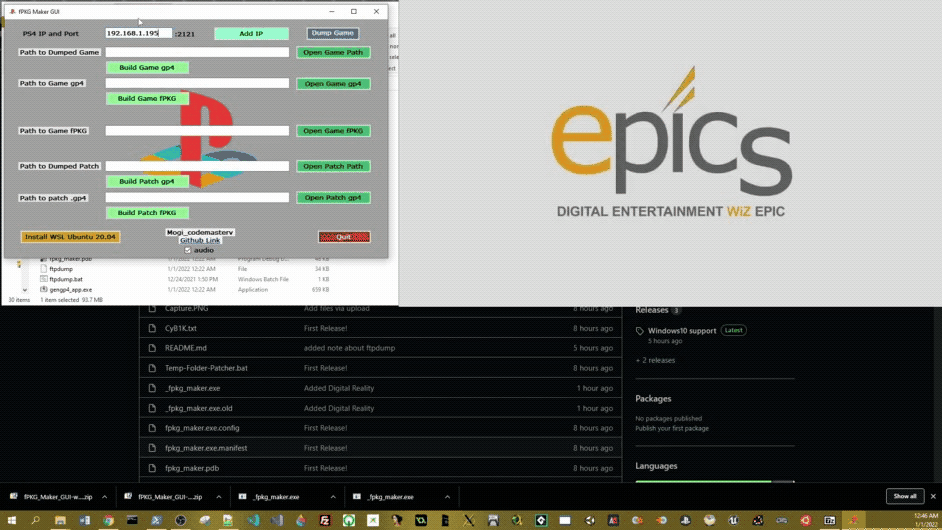

# Know Issues being worked on

# Please place this application on the root of a drive to avoid path errors.

WSL 2 operates in a lightweight VM and does not have USB pass-through access. so you can not dump a game to the usb drive but you can use the tool to build game dumps that are on a usb drive. There are hacks available to provide access for WSL and USB over IP but I will not incorperate that as it is an annoying and drawn out process.

So in short,

You cant dump directly to USB but you can move your dumps to a USB and build on the USB.

_________________________

Currently this program has an issue with directory paths with spaces in the name. 

Example: C:\MyComputer\user\my folder\fpkg_maker_gui\fpkg_maker_gui.exe

This is because it sees the space and thinks there are two folders and I need to modify the code to have trap exceptions for directories with spaces in their name.

The fix for now is to move the fpkg_maker_gui folder to the root of the drive

Example: E:\fpkg_maker_gui\fpkg_maker_gui.exe

This will allow it to run without issues.

I will fix this as soon as I can.

______________________________________________________
 # You need to be on Windows 10 or Preferably Windows 11 with its more simplified Windows Subsystem Linux. 
  Windows 8.1, Windows 8 and Windows 7 will not work with this tool.

# All fields need to be filled out before the patch will build properly

Meaning fill out the base game information first before trying to build the patch for the base game.

# Using DLC Unlocker

To use this unlocker tool go to the playstation store and find your DLC. Copy the link in your link bar and paste it into the text box below the example link and click build.

This will output the file to the directory in the log window

# WSL Ubuntu 20.04 Required

If not insalled already, Be sure to install WSL2 Ubuntu 20.04 via the button in the bottom left corner of the program 

Or, 

install from the Windows App Store. 

https://www.microsoft.com/en-us/p/ubuntu-2004-lts/9n6svws3rx71?SilentAuth=1&wa=wsignin1.0&activetab=pivot:overviewtab

This program requires that version!

# Updating the ftpdump script from hippie68

Incase I miss one of his releases or forget to update the included version.

latest version can be found here: https://github.com/hippie68/ftpdump

if you do want to use a new ftpdump script from hippie68, all you have to do is replace the ftpdump file in the same folder as the _fPKG_Maker_GUI.exe. Edit the ftpdump file and add two spaces after the

ip=

and add the port you want to use. 

port=2121

the program will make a copy of ftpdump named yourftpdump. It keeps the ftpdump persistent and untouched.

# Needed tools for WSL Ubuntu 20.04

You need to install:
____________________

sudo apt-get update -y

sudo apt-get upgrade -y

sudo apt install -y dos2unix

sudo apt install -y wget

sudo apt install -y curl

# Updating fPKG tools

If fPKG tool do get an update from v3.87 you can just dump them right in the same folder as the _fPKG_Maker_GUI.exe and overwrite the old ones.

# Video of how it works

https://www.youtube.com/watch?v=6IIYGGSWvbg

# Some planned features are:

Added DLC Unlocker

Added Terminal Window to see what is going on

//Add dropdown menu to open all tools separate from this program

//Add back port tools

//UI Polish

There is still much to do to this tool

# fPKG_Maker_GUI
A user friendly User Interface for fPKG Tools for PS4

I need to thank a few people before you read the steps

Thank you to CyB1K for his updated fPKG Tools, You can find his github here;

https://github.com/CyB1K/PS4-Fake-PKG-Tools-3.87

Thank you to hippie68 for his outstanding FTP Dump Linux Script. You can find his github here;

https://github.com/hippie68/ftpdump

Thank you to all the devs in the community!

and thank you to LightningMods, Keep that homebrew scene going my dude. He runs an outstanding website you can find by searching for DKS.

# Note

I wanted to drop this before I go silent again for my next semester of school. This is an early build so expect some bugs but as it is right now it works and will:

Dump the game via FTP and GoldenHen on port 2121

Generate gp4 files 

Build the games from the gp4 files.

and create dlc unlockers
